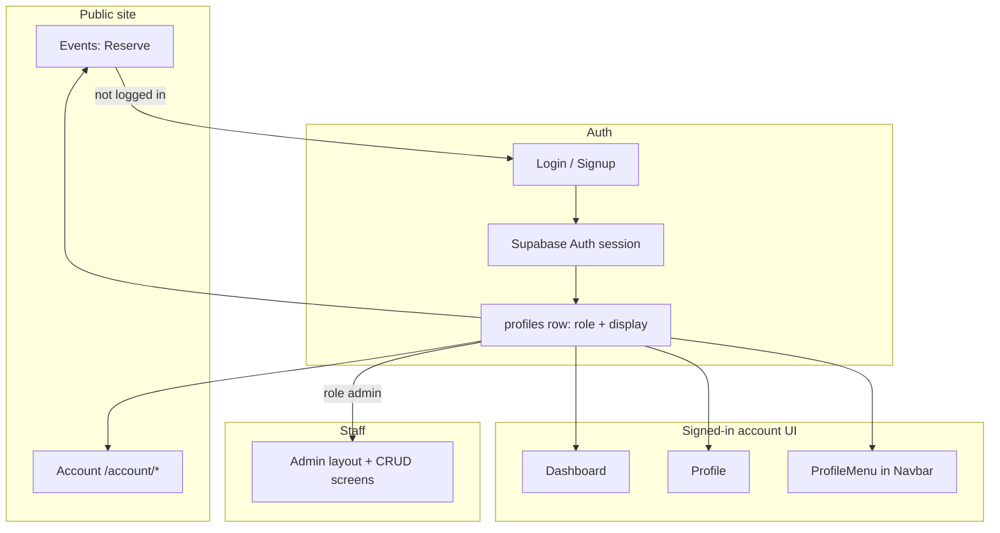

# User & Admin Dashboard / Auth — UI/UX Implementation Plan (Phase 2)

Issue: **[#114](https://github.com/maximus34530/cigar-society-genesis/issues/114)** (closed — doc delivered; use file reminder for next brainstorm)  
**Companion docs:** [`Phase_2_implementation_plan.md`](./Phase_2_implementation_plan.md) (epics A–D), [`BRANDING_STYLES.md`](./BRANDING_STYLES.md), [`GITHUB_ISSUES_GUIDE.md`](./GITHUB_ISSUES_GUIDE.md)  
**Related open issues (auth polish):** [#107](https://github.com/maximus34530/cigar-society-genesis/issues/107), [#108](https://github.com/maximus34530/cigar-society-genesis/issues/108)  
**Scope:** Customer **Dashboard** & **Profile**, **Login** / **Signup**, **Navbar** account affordances, **Admin** shell + key screens — what exists today vs what Phase 2 still implies.  
**Stack:** React 18 (Vite) + React Router v6 + shadcn/ui + Tailwind + **Supabase Auth** + `profiles` row (`role`: admin | client | user).

> **When you’re back:** brainstorm further polish (avatar **upload** vs URL-only, admin **breadcrumbs**, richer **notifications**). Capture ideas in a new issue or append a “Brainstorm” subsection below.

---

## Account & dashboard UX — what we’re aiming for (summary)

Phase 2 described a **customer “account area”** (bookings, profile, future hooks) and an **admin workspace** (CRUD, overview). What you have now is a **practical first version**: **`/dashboard`**, **`/profile`**, **`/account/*`**, and **`/admin/...`**, a **single global navbar** with `ProfileMenu` when signed in, **password + OAuth** with **return-to-intent** after login (especially from **Events**), and **role-aware** routing (admins can jump to `/admin` after login). Visual language follows the rest of the site: **dark surfaces**, **gold CTAs**, `Layout` + `section-padding` + cards with `border-border/60` and `bg-card/40`.

Most of that polish is now **implemented in code** (see **Remaining work** below for only small follow-ups). This document still describes IA and patterns for onboarding and future issues (**#107** / **#108** nuances).

---

## Desired outcome (Phase 2 alignment)

### Customer experience
- Signed-in users have a **clear home for “my stuff”**: **Dashboard** (overview + bookings + post-payment messaging), **Profile** (account card + upcoming bookings), and **`/account`** (settings + full bookings list).
- **Log in / Sign up** feel trustworthy: validation, errors, disabled submit while working, and **no dead ends** when email confirmation or rate limits bite (tracked in **#107**).
- **Reserve flow** from **Events**: if not logged in, user returns to the **same event intent** after auth (`?reserve=` query + `location.state.from`).
- **Admins** are not confused: after login, **admin role** can land on **`/admin`**; **Profile** shows **Go to Admin** when `isAdmin`.

### Staff experience
- **`/admin`** is **protected** (must be logged in **and** `profiles.role === "admin"`).
- Sidebar navigation: **Overview**, **Events**, **Clients**, **Bookings** — matches how staff think about operations.
- List/create/edit flows for **events** and read/manage patterns for **bookings** align with public site data.

### Technical / UX guardrails
- **No secrets** in client bundle for privileged operations (already true for payments; admin uses Supabase client under RLS — see backend issues for policy details).
- **Brand alignment**: headings, buttons, and cards per **`BRANDING_STYLES.md`** (gold gradient primary actions, restrained body copy).
- **Accessibility touches**: mobile menu `aria-*`, `min-h-[44px]` tap targets on mobile nav links, `ProfileMenu` keyboard-friendly dropdown (shadcn).

---

## Current state (already implemented) — detail

### 1. Routes & information architecture

| Route | Purpose | Guard |
|--------|---------|--------|
| `/login` | **Tabs:** password + OAuth, **Magic link (demo)** | Redirects when already signed in; preserves **`from`** for Signup |
| `/signup` | Full name + email + password sign-up | Same redirect behavior when already signed in |
| `/profile` | Account summary + **My bookings** | **`RequireAuth`** → unauthenticated users sent to `/login` with `state.from` = current path |
| `/dashboard` | **Primary** signed-in hub: notifications-style cards, **Upcoming** / **History** bookings, Stripe return handling | **`RequireAuth`** |
| `/account` | Redirects to **`/account/profile`**; nested **Profile** + **Bookings** under one shell | **`RequireAuth`** (layout) |
| `/account/profile` | **Profile & security**: edit `full_name`, optional **avatar URL**, **change password** | **`RequireAuth`** |
| `/account/bookings` | Full **bookings** list (upcoming + past) with same actions as Profile | **`RequireAuth`** |
| `/admin` | Admin overview (stats cards) | **`RequireAdmin`** |
| `/admin/events` | Events CRUD + image upload + trash | **`RequireAdmin`** |
| `/admin/clients` | Clients listing / management UI | **`RequireAdmin`** |
| `/admin/bookings` | Bookings list, search, status, truncated Stripe ids, delete | **`RequireAdmin`** |

**Note:** `AdminSessions` exists as a lazy import in `App.tsx` history in some branches; the **current** router wires **Overview, Events, Clients, Bookings** only. Overview still uses the word “sessions” in a few **labels** while counting **`events`** — cosmetic naming to clean up later.

---

### 2. Global shell & marketing chrome

- **`Layout`**: wraps most pages; includes **`Navbar`**, footer pattern, and main content area.
- **`Navbar`** (desktop):
  - Primary marketing links: Home, About, Cigars, Events, Gallery, Contact.
  - **Signed out:** “Log In” + “Sign Up” text links (uppercase, tracking, hover primary).
  - **Signed in:** **`ProfileMenu`** (avatar + truncated display name on `sm+`): links to **Profile**, **Account settings** (`/account/profile`), **Log out**.
- **`Navbar`** (mobile): hamburger → full-screen menu; same links + **ProfileMenu** or Log In / Sign Up with **44px min touch targets**; closes on route change and supports **Escape** on the menu container.
- **Scroll behavior:** navbar gains **backdrop blur + border + shadow** after scroll for readability over hero content.
- **Age gate:** entire app sits behind **`AgeGate`** until verified (`App.tsx`); independent of auth but part of first-run UX.
- **Toasts:** `Toaster` + Sonner for feedback (e.g. Dashboard post-checkout).

---

### 3. Authentication — data layer & context

- **`QueryClientProvider`** (`@tanstack/react-query`) wraps **`AuthProvider`** in **`main.tsx`** for shared server state (bookings, admin lists, overview).
- **`AuthProvider`**:
  - **`getSession`** on mount + **`onAuthStateChange`** for live session updates.
  - Loads **`profiles`** row: `id`, `full_name`, `avatar_url`, **`role`** (`admin` | `client` | `user`).
  - Exposes: `loading`, `session`, `user`, `profile`, **`refreshProfile()`**, **`signOut()`**, **`isAdmin`** (`profile?.role === "admin"`).
- **`useAuth()`**: thin context consumer; throws if used outside provider.

**Implication for UI:** any component can branch on `user`, `profile`, `isAdmin` without prop drilling.

---

### 4. Route guards

- **`RequireAuth`**: if `loading` → **`AuthLoadingFallback`** (branded spinner); if no `user` → **`<Navigate to="/login" state={{ from: pathname }} />`**.  
  - **Effect:** deep links to `/profile`, `/dashboard`, or `/account/*` survive login.
- **`RequireAdmin`**: if `loading` → **`AuthLoadingFallback`**; if no user → login with **`state.from`** preserved; if user but not admin → **`/dashboard`**.  
  - **Effect:** customers never see admin chrome; admins never see admin without role.

---

### 5. Login page (`/login`)

- **Layout:** `Layout` + `SectionHeading` + card with **tabs**: **Password** vs **Magic link (demo)**.
- **OAuth:** **Google** and **Apple** both use **`signInWithOAuthProvider`** + **`/auth/callback`** (same return-path stash as Signup).
- **Password tab:** **React Hook Form + Zod** — email + password; **`signInWithPassword`**; loads **`profiles.role`**; **`resolvePostLoginPath(from, isAdmin)`** for destination.
- **Magic link tab:** **Demo only** — email submit shows **“Check your email”** and a **cooldown**; explicitly **does not** call **`signInWithOtp`** until product enables it (**#108**).
- **Cross-link:** “Don’t have an account?” → **`/signup`** preserving **`state.from`**.

---

### 6. Signup page (`/signup`)

- **Layout:** same pattern as Login (heading + card).
- **Form:** full name, email, password (Zod); `signUp` with `options.data.full_name` for Supabase user metadata.
- **Submit:** handles **no session** after `signUp` with a **check-email** phase, rate-limit messaging, and cooldown where applicable — see **`Signup.tsx`** and **`authRouting`** (**#107** alignment).  
- **Magic link** for signup is still password-first; Login hosts the **demo** tab (**#108**).

---

### 7. Profile page (`/profile`)

- **Guard:** `RequireAuth`.
- **Layout:** two-column grid on `md+`: **Account** card (1 col) + **My bookings** (2 cols).
- **Account card:**
  - Avatar (image or initial), display name / email, **role badge** (`Role: admin|client|user`).
  - **Refresh profile** (calls `refreshProfile()`).
  - **Log out** (direct `signOut`).
  - **Go to Dashboard** (outline, primary border).
  - **Account settings** → **`/account/profile`** (full editor + password).
  - **Go to Admin** (gold CTA) — **only if `isAdmin`**.
- **Bookings card:** (data via **`useUserBookings`** + TanStack Query; invalidate on cancel.)
  - Loads user’s **`bookings`** with embedded **`events(id,name,date,time)`**.
  - **Loading** and **error** states (destructive-styled error box).
  - **Empty state:** dashed border, “No bookings yet”, **Browse events** CTA.
  - **Rows:** event title, **`bookingStatusLabel`**, date/time, tickets + total; **Pending payment** shows hint + **Complete payment** (re-opens Stripe via `createCheckoutSessionUrl`); **Cancel** opens confirm dialog → **delete** booking.
- **Profile editing** lives on **`/account/profile`** (name, avatar URL, password); this page stays a **compact account card** + bookings.

---

### 8. Dashboard page (`/dashboard`)

- **Guard:** `RequireAuth`.
- **Personalization:** greeting uses `profile.full_name` or “there”.
- **Post-Stripe return:** reads **`?checkout=success`** + **`session_id`** → invokes **`finalize-checkout-session`** Edge function → toast success vs “syncing…” → **`queryClient.invalidateQueries(userBookingsQueryKey)`** → optional **success banner** → **strips query params** with `replace`.
- **Bookings:** TanStack Query **`useUserBookings`** (shared cache with Profile / Account bookings); splits into **Upcoming** vs **History** by parsing `event.date` + `event.time`.
- **Notifications strip:** small cards (upcoming event teaser, welcome if empty, phone help) — lightweight “dashboard feel” without a full notification system backend.
- **Actions:** **Complete payment** for `pending_payment`, **Cancel** with dialog (delete), link to **Events** / **Contact** / **Directions** (`business.mapUrl`) as appropriate in layout.
- **Scroll affordance:** ref to bookings section for post-checkout UX (anchor behavior in code).

---

### 9. Admin area (`/admin/*`)

- **`AdminLayout`**: `RequireAdmin` → `Layout` → **two-column grid**: **sticky sidebar** (280px) on large screens + main column.
- **Sidebar:** **NavLink**s with icons (Overview, Events, Clients, Bookings); active state uses **muted background + primary ring**; horizontal scroll on small screens with **snap** for touch.
- **Header strip:** “Dashboard Overview” title + subtitle + **`ProfileMenu`** (sign out, etc.).
- **`AdminOverview`**: **Nav CTAs** (Manage events / All bookings / Clients); **stat cards** — **`useAdminOverviewData`**: counts for **`events`**, **`clients`**, **`bookings`**; **paid ticket revenue** (sum of `total_paid` where `status === "paid"`) with honest hint about Stripe fees; **Upcoming** + **Recent activity** lists from **real** booking rows (empty states when none). Animated count-up on numeric stats (`useCountUpOnView`).
- **`AdminEvents`**: full **CRUD** for events (form, image upload to storage, soft delete / trash, restore) — this is the heaviest admin UI; aligns with **Epic B** in Phase 2.
- **`AdminClients`**: client records UI (wired to `clients` table per project).
- **`AdminBookings`**: **`useAdminBookingsList`** (TanStack Query); searchable list; **Delete** invalidates admin list + overview queries.

---

### 10. Events ↔ Auth handoff (cross-page UX)

- **`openReservation`**: if **`!user`**, navigates to **`/login`** with `state: { from: "/events?reserve=<eventId>" }`.
- **Effect on `/events`**: when **`user`** + **`?reserve=`** present after load, finds event, calls **`openReservation`**, then **removes** the query param (clean URL).
- **Stripe cancel return:** strips `checkout=cancelled` + `event_id` query params (user lands calmly back on Events).

This satisfies Phase 2’s “**smooth auth handoff**” intent for ticket purchase; the same mechanism supports returning to **any** `from` path you pass into login/signup.

---

### 11. Shared helpers & patterns

- **`bookingStatusLabel`** (`src/lib/bookingStatus.ts`): human-readable **`paid`**, **`pending_payment`**, **`cancelled`**, default underscore replacement — used on Dashboard and Profile badges.
- **Checkout resume:** **`createCheckoutSessionUrl`** (shared lib) + `window.location.href` for **Continue / Complete payment** flows.
- **SEO:** `Seo` component on Login, Signup, Profile, Dashboard, Admin root.

---

## Dumbed-down flow (guest → account)

### What the user sees

1. They browse the marketing site; **Age gate** appears once.
2. They open **Events** and tap **Reserve**. If not logged in → **Login** with a “return ticket” in the URL state.
3. They **log in** (or **sign up**). Password is checked; profile role is loaded.
4. They land back on **Events**; the app **opens the reservation** for the same event automatically.
5. After booking (free or paid), they use **Dashboard** and **Profile** to see status, **complete payment** if needed, or **cancel**.
6. **Admins** also see **Go to Admin** on Profile and can use **ProfileMenu** anywhere.

### How it fits together (visual)

---

## Remaining work (next steps)

### Shipped in repo (high level)
- [x] **AdminOverview** — real **paid revenue** sum, real **upcoming** / **recent activity** from bookings, **nav CTAs** instead of placeholder Quick Action / time dropdown.
- [x] **Auth loading** — **`AuthLoadingFallback`** for **`RequireAuth`** / **`RequireAdmin`** (no blank `null`).
- [x] **TanStack Query** — **`useUserBookings`**, **`useAdminBookingsList`**, **`useAdminOverviewData`**; invalidation on cancel / delete / post-checkout.
- [x] **`/account`** hub — **`/account/profile`** (edit profile + password), **`/account/bookings`**; **ProfileMenu** + Profile link to settings.
- [x] **Login** — **Magic link (demo)** tab + **unified OAuth** redirect behavior; password tab unchanged for real sign-in.
- [x] **Signup** — **#107**-style paths already in **`Signup.tsx`** (check email, rate limits, return path stash).

### Optional follow-ups
- [ ] **Avatar storage** — optional **Supabase Storage** upload + policies if you outgrow **URL-only** avatars on **`/account/profile`**.
- [ ] **Real magic link** — enable **`signInWithOtp`** when SMTP/product is ready (**#108**).
- [ ] **Dashboard vs Profile** — further differentiate copy or consolidate lists if duplication still feels noisy.
- [ ] **Admin breadcrumbs** on deep pages.
- [ ] **Dedicated “please log in”** interstitial instead of instant **`Navigate`** (optional).

---

## Testing checklist (manual)

- [ ] **Logged out:** Navbar shows Log In / Sign Up; `/dashboard` and `/profile` redirect to login with correct **`from`**.
- [ ] **Login:** wrong password shows error; success goes to **`from`**; admin with default from goes to **`/admin`**.
- [ ] **Events reserve:** logged out → login → returns to event with dialog opened.
- [ ] **Profile:** bookings load; pending payment → complete payment opens Stripe; cancel removes row.
- [ ] **Dashboard:** post-payment query flow + banner; upcoming/history split sane for past events.
- [ ] **Admin:** non-admin user hitting `/admin` ends on **`/dashboard`**; admin sees sidebar + overview loads.
- [ ] **Account:** `/account` redirects to **`/account/profile`**; bookings tab lists past + upcoming; profile save updates **`profiles`** and password uses **`auth.updateUser`**.

---

## Open decisions (from Phase 2 — still relevant)

1. **Dashboard vs Profile:** one mental model for customers (“Dashboard is home” vs “Profile is home”) — drives nav labels and marketing links.
2. **Admin staffing:** shared admin accounts vs per-staff users (affects invite UX and audit).
3. **Identity:** stay on **password** only for v1, add **Google OAuth**, or prioritize **magic link** after **#107** SMTP story.

---

## My Personal Summary

Big picture  
You already have the **bones of Phase 2 “account life”**: people can **sign up**, **log in**, land back on **Events** to finish a booking, then use **Dashboard** and **Profile** to see **paid vs waiting on payment**, hit **Stripe again** if they bailed mid-checkout, or **cancel**. Staff with an **admin** role get a **separate sidebar world** at **`/admin`** to run **events**, see **bookings**, and skim **counts** — all wrapped in the same **dark lounge + gold button** look as the marketing site.

Guest: “Where do I go after I log in?”  
If they were trying to **book**, they pop back to **Events** with the **reserve** deep link. If they just clicked Log in, they usually end on **Profile** — unless they’re **admin**, then they jump to **Admin** so they don’t hunt for a hidden door.

Signed-in customer: “Where’s my stuff?”  
**Dashboard** feels like the **hub** (especially after paying — confetti-ish banner + toasts). **Profile** is the **same bookings list** plus **account card** (avatar, role, shortcuts). The **navbar avatar menu** is always there for **Profile** or **Log out**.

Admin: “Where’s work?”  
**`/admin`** is the **office**. Sidebar = **Overview / Events / Clients / Bookings**. They’re editing the **same events** the public sees — the website and the back office share one database truth.

What’s still “Phase 2-ish” but not perfect yet  
**Signup** edge cases are largely handled in code (**#107**), and Login includes a **magic-link demo** (**#108**) without enabling OTP yet. **Admin overview** now reflects **paid booking totals** and **live lists**. **Loading** during auth resolution shows a **branded spinner** instead of an empty frame.

One sentence per room  

| Room | Dummy explanation |
|------|---------------------|
| **Navbar** | Public menu + either **Log in / Sign up** or your **face in a circle** that opens **Profile / Log out**. |
| **Login & Signup** | The **bouncer desk**: password or OAuth, optional **magic-link demo** (no OTP yet), checks Supabase, sends you back to **`from`**. |
| **Profile** | Your **ID card wall** plus **ticket list** — see bookings, **pay** if you forgot, or **cancel**. |
| **Dashboard** | The **lobby TV** — “here’s what’s next”, **upcoming vs past**, and **we got your Stripe money** banner. |
| **Admin** | The **manager’s office** — counts, **events machine**, **bookings ledger**. |

That’s the story so far: **marketing site + age gate → auth → two customer home pages + optional admin office**, all on the **same visual system**. The next push is mostly **making the rough edges feel intentional** (signup, spinners, copy, maybe one clear “home” for customers).
